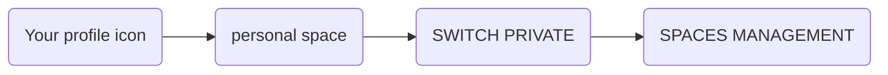

---
# This is the title of the article
title: Ban principles
pageInfo: false
# This is the icon of the page
# icon: page
# This control sidebar order
order: 3
# Set author
author: Monumental Team     
# Set writing time
date: 2020-01-01
# A page can have multiple categories
category:
  - Guide
# A page can have multiple tags
tag:
  - Page config
  - Guide
# this page is sticky in article list
sticky: true
# this page will appear in starred articles
star: true
copyright: false
footer: Monumental | Copyright © 2023
lastUpdated: false
contributors: false

---
In the event that an artwork does not meet the artistic criteria of a space or the artwork’s ownership has not been verified or a disagreement occurs between the space manager and the artist or collector, the space manager has the option to ban the artwork from his space. By banning an artwork will result in the artwork is no more visible on the Platform. 
At any times a ban can be reversed by the space manager.

::: warning Important
The ban can only be done when an artwork is not on sale. 
To ensure a complete ban on a space for a limited edition, the space manager will need to unpublish all existing space contracts linked to each edition on his space.
:::

This guide is intending to explain how a ban can be set and depending on your role on the platform how to deal with it.

## Space Manager:

### Set up a ban:
As a space manager in order to ban an artwork from your space, you will need to follow these steps:
1.	Go to:

2. Under the section Current Space
3. Select from the space list the space where you wish to ban the artwork
4. Once selected, go under section Space Contracts
5. Select either Member Contract or Guest Contract depending on the space contract established with the artist or the collector
6. Select in the list the artwork you wish to ban
7. The artwork is displayed
8. Click on the ON SPACE button (the icon is crossed out)
9. The artwork is banned on the space and not published anymore 
10. To verify the artwork is banned from your space, click on the artwork itself
11. This will direct you to the artwork detailed view
12. Under Editions, the space icon has disappeared indicating that the artwork is no more visible on the space

 
By banning an artwork, this translates to the space contract between the seller and the space is on hold.
If an artist or a collector tries to publish or sale his artwork on your space, the following message “Your artwork is banned from your space manager” appears. No publishing nor sale can occur.
The only way to allow a publishing or a sale on a banned artwork is to the artwork 

### Reverse a ban:

At any times, a placed ban can be reversed. 
 
To simply reverse (or remove) the ban placed on the artwork, 

1. Go to:

2. Under the section Current Space
3. Select from the space list the space where you wish to remove the ban on the artwork
4. Once selected, go under section Space Contracts
5. Select either Member Contract or Guest Contract depending on the space contract established with the artist or the collector
6. Select in the list the space contract where the ban has been placed
7. The banned artwork is displayed
8. Click on the ON SPACE button (the icon is no more crossed out)
9. The ban has been lift up
10. To verify the artwork is not banned from your space anymore, click on the artwork itself
11. This will direct you to the artwork detailed view
12. Under Editions, the space icon appears indicating that the artwork is now authorised to be published on your space

::: warning Important:
The owner of the artwork still needs to agree on the publishing on your space by enabling the slide button (blue colour) under the section “Spaces” from the detailed view page. From now the owner will be able to sale his artwork on the Platform.
:::

## Artist and collector:
Your artwork has been banned from your space manager. First understand the reason behind this ban by contacting the space manager. 

If you come with an agreement where your artwork is now authorised on the space, 

