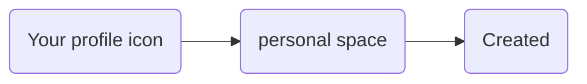
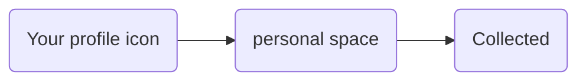
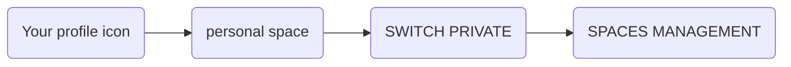

---
# This is the title of the article
title: Right to be forgotten
pageInfo: false
# This is the icon of the page
# icon: page
# This control sidebar order
order: 3
# Set author
author: Monumental Team     
# Set writing time
date: 2020-01-01
# A page can have multiple categories
category:
  - Guide
# A page can have multiple tags
tag:
  - Page config
  - Guide
# this page is sticky in article list
sticky: true
# this page will appear in starred articles
star: true
copyright: false
footer: Monumental | Copyright © 2023
lastUpdated: false
contributors: false
---
At Monumental, artwork is the central piece of our ecosystem. We believe in freedom of choice, creator and collector decide by themself where and when their artworks can be displayed on the Platform for all to see.  

This guide is intending to explain how to apply the right to be forgotten.
 
## Unpublishing artwork by owner

### Created artworks
For a **standard edition**, your artwork is by default not visible to anyone on the Platform. As an artist and owner of your artwork you will be the only person to see your new creation. 
 
For a **community edition**, your artwork is by default visible to everyone on the Platform, (your artwork will be displayed on the portal page under the section **JUST LANDED**) since when you created your artwork you selected the space where your community edition should be submitted. 
 
In both cases you will be able to find you artwork under your personal space:

Once your artwork has been submitted and approved to a space, it will be published meaning that it will be visible to everyone on the Platform.

::: info Note
For more information about subscription, please refer to the section [Space Subscription](/guides/spaceSubscription.md).
:::

If you decide that you are not yet ready to show your artwork, you have the possibility to **unpublish** your artwork or to make it invisible. This is also known as the right to be forgotten.

To do this:
1. Click on your artwork
2. You will be directed to the detailed view of the artwork
3. Under the section **Spaces**, a list of spaces indicates where your token (artwork) is published. This is represented by the blue colour of the slide button. If no slide button appears this means that your artwork has not been primarily submitted to a space.
4. Select form the list the token you desired to unpublish from a space 
5. Disable the slide button (grey colour= unpublish) 
6. Under the section **Editions** the space icon linked to your token disappears
7. This confirms that your token is no more visible on the space where you decided to unpublish it

::: info Note
If your artwork is not published in any space you will not be able to produce a sale of your artwork.
:::

To simply publish the artwork again on the space, enable the slide button under the section **Spaces** of your artwork’s detailed view window. The colour of the slide button is now blue.

### Collected artworks
When you import your artworks onto Monumental using your digital wallet, they are not visible to anyone on the platform by default.  

::: warning Important
At Monumental, subscription inheritance is a crucial aspect of our platform. Whenever an artwork is sold on a space, the new owner of that collected artwork will have it automatically published on that space by default. This streamlines trading on the secondary market. For more information, please refer to [Space Subscription](/guides/spaceSubscription.md) guideline.
:::

However, as a collector, you have access to your personal space where you can view all of the artworks you have collected.

Once your artwork has been submitted and approved to a space, it will be published and visible to everyone on the platform. However, if you are not yet ready to showcase your artwork, you have the option to unpublish or make it invisible, which is also known as the right to be forgotten.

To do this:
1. Click on your artwork
2. You will be directed to the detailed view of the artwork
3. Under the section **Spaces**, a list of spaces indicates where your token (artwork) is published. This is represented by the blue colour of the slide button. If no slide button appears this means that your artwork has not been primarily submitted to a space.
4. Select form the list the token you desired to unpublish from a space 
5. Disable the slide button (grey colour= unpublish) 
6. Under the section **Editions** the space icon linked to your token disappears
7. This confirms that your token is no more visible on the space where you decided to unpublish it

::: info Note:
If your artwork is not published in any space you will not be able to produce a sale of your artwork.
:::

To simply publish the artwork again on the space, enable the slide button under the section **Spaces** of your artwork’s detailed view window. The colour of the slide button is now blue.

## Unpublishing artwork by a Space Manager 

It is important to mention, that a space manager is allowed as well to unpublish/publish an artwork from his managed space. 
When you (as an artist or a collector) are submitting a subscription proposal to a space and the space manager approve your proposal, a space contract is created between you and the space manager.
Please refer to [Space](/started/spaces.md) guideline for more details. 

If you are a space manager, to **unpublish/publish** an artwork displayed under your space, please follow these steps:

1. Under the section **Current Space**
2. Select from the space list the space where you wish to unpublish the artwork
3. Once selected, go under section **Space Contracts**
4. Select either **Member Contract** or **Guest Contract** depending on the space contract established with the artist or the collector
5. Select in the list the artwork you wish to unpublish 
6. The artwork will be displayed 
7. Click on the **on space** button (the icon is crossed out)
8. The artwork on the space is not published anymore
9. To verify the artwork is unpublished, click on the artwork itself 
10. This will direct you to the artwork detailed view 
11. Under **Editions**, the space icon has disappeared indicating that the artwork is no more visible on the space

::: info Note
As a reminder, if an artwork is not published in any space the artwork cannot be for sale. 
:::

To simply publish the artwork again on the space, click on the **on space**  button (the icon is no more crossed out) under the section **Space Contracts**.
To verify the artwork is published, click on the artwork itself under the section **Space Contracts**. The detailed view of the artwork window appears, under the section **Editions** the space icon is present.
