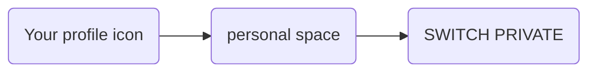

---
# This is the title of the article
title: Space Manager
pageInfo: false
# This is the icon of the page
# icon: page
# This control sidebar order
order: 3
# Set author
author: Monumental Team     
# Set writing time
date: 2020-01-01
# A page can have multiple categories
category:
  - Guide
# A page can have multiple tags
tag:
  - Page config
  - Guide
# this page is sticky in article list
sticky: true
# this page will appear in starred articles
star: true
copyright: false
footer: Monumental | Copyright © 2023
---
As a space manager, it is your responsibility to oversee and elevate the artists within your designated space. From your personal space, you have the ability to conduct a variety of tasks, including inviting individuals to join, promoting artists, making decisions on proposals, and efficiently managing collections, features, and drops.

To access those functionalities, click on :

This guide is intending to explain activities of a space manager and how to carry out them on the platform.

## Becoming a space manager

To attain the position of a space manager, you must submit an online application and undergo a thorough evaluation of your professional competencies. Upon successful completion, access will be granted.

[Apply as a space manager](https://monumental.app/apply/manager)

## Select the current Space

On monumental, a space manager can handle several spaces from the space management section.
The dropdown selection show the one available for the space manager.

## Define members in your space

Under the Space Management section, a space manager can decide if an user becomes a member to his space.  
To do so, the space manager will need to add manually this user :

First select the right space where the user will be defined as a member under “Current Space” by using the space list.
Once the space has been selected, under section “ Space Members”, click on the add button (“+”) a window appears :

**Fill up the form as follows :**

> 1. Select the member type from the available option
> 2. Enter the user ETH public Address under the field “Member address”
> 3. Enter commission and fees to be apply
> 4. Click SAVE. 

The user is then added as a member to the space.

::: info
The space manager can at anytime by selecting the user within the Space Members section, editing (commission or fees review) or removing the user.
::: 

Please refer to [Space Members](/started/space.md#space-members) to get more information about the **member type** and its impact on subscription contract.

## Manage space contracts

This section allows a space manager to manage all space contracts that have been generated on his space.
A space contract is a business relationship between a user and a space.

- Member and Guest contracts tabs : 
    - list all contracts that have been generated for members and guest. 
      The different contract status will be shown in order to understand if a contract is still _active_  _expired_ _inactive_ or _pending_registered_
    - create a new space contract
    - edit an existing space contract
    - delete an existing space contract

- Pending proposal tab: 
    - list all pending proposals sent by users to the space.

::: info
Pending proposals sent by the space manager are under the Member our Guest tabs
:::
    
For more information, please refer to “Accepting or rejecting Proposal from an artist”

For member and guest contracts, the space manager can send a **space contract proposal** to a registered user by clicking on the envelope button.

### Accepting or rejecting Proposal from user

**Pending Proposal:**
Once an user is registered on the platform and he is not member of a space , he will be able to offer his artworks to be published on a space. The space manager has either the choice to accept or reject his proposal.
Under the **Space Contracts section**, go the tab **Pending Proposal**, all pending proposal for a specific space will be listed under this section.
By selecting one proposal, the space manager will be able to :
-	Visualise the artwork
-	Accept the artwork to be published on the space by clicking **accept**
-	Reject the artwork to be published on the space by clicking **reject**

**Guest Contract:**
If the space manager accepts the artwork, automatically a publishing contract will be generated with a specific valid period under the section **Guest Contract**. 
This contract allows the artist to sale his artwork during a valid period on this space.

## Handle digital promotion
Under the **digital promotion section**, the space manager is able to promote artworks published on his space. 

### COLLECTIONS
He is in title to create a collection, gathering different artworks from artist on his space.
Ensure the right space is primarily selected under the section” Current Space”.
Click on “+” a window appears, 
Fill up the form as follow :
1. Enter a collection Name
2. Enter a slogan
3. Enter more information about the collection in the description field (optional).
4. Click SAVE. 

Once the collection is created, you still need to add some artworks. To do so, proceed as following:
 
1. Select the newly created collection 
2. Press the **add editions** button in the selected record
3. Within the artworks selection window, select the member to whom the artworks should be part of this collection. 
4. Artworks belonging to the member can be selected form the first or the second market simply by dragging and dropping those from the column “Available” to the column “Selected”. 
5. Once the artworks have been selected, click **ADD TO COLLECTION**.
6. The window auto-closed and you can see artworks by expanding (double-click) the collection.
6. If needed, repeat steps 1-5 to add more artworks from a different member.

At this stage, the collection is still not visible into Monumental because the collection is **unpublished**. 
To finalise the promotion, click the **Publish** button.

> The collection is now promoted and can be visible on the portal page under the section **COLLECTIONS**.

::: info
Collection can be editing or removing.
:::

### FEATURES
Feature allows space manager to promote different collections on the platform.
 
::: warning
Collections have to be set in the first place on the space.
:::

To create a feature, click on “+”. A window appears.
Fill up the form as follow
1. Enter the Feature Name
2. Enter the start and end dates
3. Click the save button

The newly created feature will be available under “Features”. 
Ath this stage, you need to add collections to the feature.

Proceed as follow :
1. Select the new feature 
2. Click “ADD COLLECTIONS”
3. Within the collection window, select one collection available and drag and drop it from the “Available” column to the “Selected” column,
4. Once complete, click “ADD TO FEATURE”
5. Click SAVE

At this stage, the feature is still not visible into Monumental because the feature is **unpublished**. 
To finalise the promotion, click the **Publish** button.

::: info
Feature can be editing or removing.
:::

### DROPS

Coming soon
