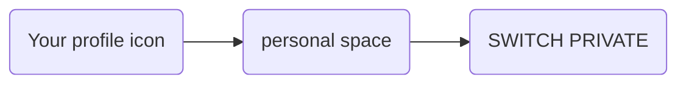

---
# This is the title of the article
title: Space Subscription
pageInfo: false
# This is the icon of the page
# icon: page
# This control sidebar order
order: 3
# Set author
author: Monumental Team     
# Set writing time
date: 2020-01-01
# A page can have multiple categories
category:
  - Guide
# A page can have multiple tags
tag:
  - Page config
  - Guide
# this page is sticky in article list
sticky: true
# this page will appear in starred articles
star: true
copyright: false
footer: Monumental | Copyright © 2023
---
Space’s goal is to elevate the visibility and financial success of the artists they
support. 
Artist and collector on the platform can sale their own artwork or collection on the first
or second market. Those items need however to be first published on a space in
order to be visible and sold. 
This process is called **subscription**. You can subscribe as a **Member** or as a **Guest**.
By subscribing, a space contract is generated. This space contract is a business
relationship between a seller and the space. It defines the duration of the relationship
and the commission rate applied to sales on the first or second market. 
As a member and depending on the roles you have been assigned on a space
(please refer to [space](/started/spaces.md) for more details) you are allowed to subscribe to this space
when you want to publish your artwork. 
From the detailed view of your artwork, under the section **Spaces** a list of spaces
where you are authorized to publish (sale) is made available to you. 
This list presents your right to subscribe on a space as **Member Quick connect**
This option allows you to get publish on a space without any approval required by the
space manager. 
To action a Quick Connect, under the section **Spaces +** you need to:
1. Select the space where you like your artwork to be published
2. Click on the **+**
3. By clicking **+**, this will generate automatically an approved subscription

Your artwork is now visible on the portal page under the section **JUST LANDED**.
You will be able to sale your artwork on that space if you wish to do so. 

::: info Note
When your artwork has been sold, the new owner will inherit the spaces where
your artwork has been published. By default, the artwork is published on the space
where the sale occurred.
::: 

**Guest Connection:** 
As a member of a space you are still allowed to subscribe to another space where
you are not a member. You will be then defined as a Guest if your subscription has
been approved by the space manager.
To apply as a guest, from the detailed view of your artwork you wish to publish, under
the section **Spaces +** you need to: 
1. Click on **+** in the section **Space +**
2. A window **Subscription contract** appears
3. Fill up the form:
- Enter a start and end date for your subscription
- From the field **Space**, choose in the listed spaces, the space where
you are not a member and you wish to subscribe. Space fees applied
will be displayed for your information
- In the field **Message** explain why you would like to join this space. The
space manager will see this message.
- Agree with the space conditions
- Press **SUBSCRIBE**

Your subscription is sent to the space manager for approval. 
You can follow the status of your subscription on your personal space. 
To follow the status of you subscription, go to your profile as follows:

Your subscription contract is on status **Pending (space)** 
If the space manager approves your subscription, the status changes to **Active**. If
the space manager rejected your subscription, then the status shows **Rejected**. 
Once your subscription has been approved, on the detailed view of your artwork, a
new line will appear under the section **Space +** indicating the space icon where
you just subscribed and an information **Guest**. 
Your artwork is now visible on the portal page under the section **JUST LANDED**.
You will be able to sale your artwork on that space if you wish to do so.

::: info Note
When your artwork has been sold, by default, the artwork is published on the space where the sale occurred. 
However, by inheritance, the artwork can also be published in all the previous spaces where it has been published by previous owners.
::: 

## Guest subscription
All artist or collector that are not a member of a space can still subscribe to a space
in order to publish his artwork.
To apply as a guest, from the detailed view of your artwork you wish to publish, under
the section **Spaces +** you need to:
1. Click on **+** in the section **Space +**
2. A window **Subscription contract** appears
3. Fill up the form:
- Enter a start and end date for your subscription
- From the field **Space**, choose in the listed spaces, the space where
you wish to subscribe. Space fees applied will be displayed for your
information
- In the field **Message** explain why you would like to join this space. The
space manager will see this message
- Agree with the space conditions
- Press **SUBSCRIBE**

Your subscription is sent to the space manager for approval. 
You will be able to follow the status of your subscription on your personal space.
To follow the status of you subscription, go to your profile as follows :

Your subscription contract is on status **Pending (space)** 
If the space manager approves your subscription, the status changes to **Active**.  
If the space manager rejected your subscription, then the status shows **Rejected**
Once your subscription has been approved, on the detailed view of your artwork, a
new line will appear under the section **Space** indicating the space icon where
you just subscribed and an information **Guest**. 
Your artwork is now visible on the portal page under the section **JUST LANDED**.
You will be able to sale your artwork on that space if you wish to do so.

::: info Note
When your artwork has been sold, by default, the artwork is published on the space where the sale occurred. 
However, by inheritance, the artwork can also be published in all the previous spaces where it has been published by previous owners.
::: 

## Accepting an offer on your artwork
Monumental offers the functionality to accept offer made on your artwork and to
trigger a private sale on a specific space where you are a member.
From the detailed view of your artwork, select **show details** of the artwork.
Under the tab **OFFERS**, accept the offer listed. When accepting the offer, the
window **Private Sell** appears. The system detects automatically any existing
subscription linked to your artwork. If you wish to sale your artwork on an existing
space, simply select the space.
1. Select the space where you like your artwork to be published
2. Click NEXT
3. The condition of the sale on the space will be displayed

## Selling your artwork but no subscription on a space
As an owner of an artwork, you would like to sale your artwork or accept an offer
made on your artwork in a space where you did not subscribe beforehand.
Monumental gives the opportunity to still subscribe to that space.
From the detailed view of your artwork:
- When pressing the action button **SELL** , the window **Sell an artwork**
appears.
- Or when accepting an offer, under the tab **OFFERS**, the window **Private
Sell** appears.

::: warning 
the system detects automatically any existing subscription linked to your
artwork. If you wish to sale your artwork on an existing space, simply select the
space.
:::

If you want to subscribe to a new space, please follow the steps:
1. Click **NEW SUBSCRIPTION**
2. The window **Subscription contract** appears
3. Fill up the form:
- Enter a start and end date for your subscription
- From the field **Space**, choose in the listed spaces, the space where
you wish to subscribe. Space fees applied will be displayed for your
information
- In the field **Message** explain why you would like to join this space. The
space manager will see this message

- Agree with the space conditions
- Press **SUBSCRIBE**

Your subscription is sent to the space manager for approval.
You will be able to follow the status of your subscription on your personal space.
To follow the status of you subscription, go to your profile as follows :
                                                

Your subscription contract is on status **Pending (space)** 
If the space manager approves your subscription, the status changes to **Active**. 
If the space manager rejected your subscription, then the status shows **Rejected**
Once your subscription has been approved, on the detailed view of your artwork, a
new line will appear under the section **Space** indicating the space icon where
you just subscribed and an information **Guest**.
Your artwork is now visible on the portal page under the section **JUST LANDED**.
You will be able to sale your artwork on that space if you wish to do so.    

::: info Note
When your artwork has been sold, by default, the artwork is published on the space where the sale occurred. 
However, by inheritance, the artwork can also be published in all the previous spaces where it has been published by previous owners.
::: 

